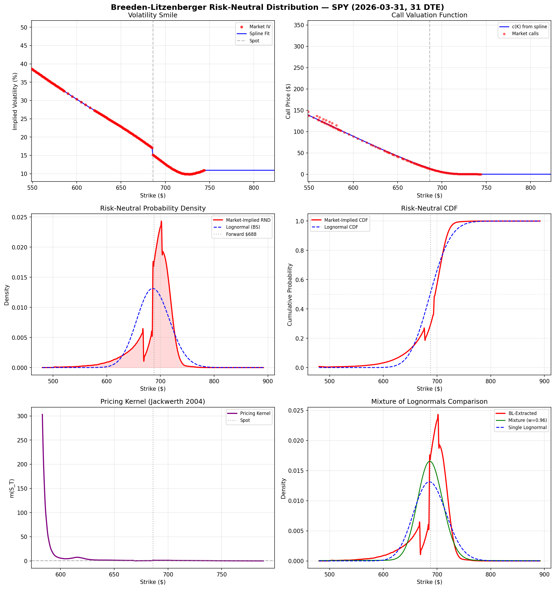
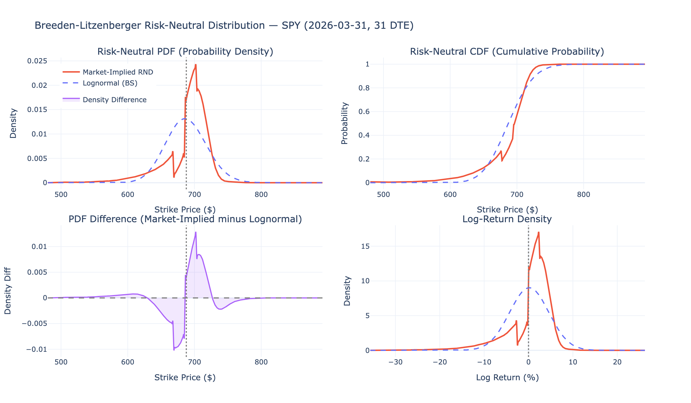
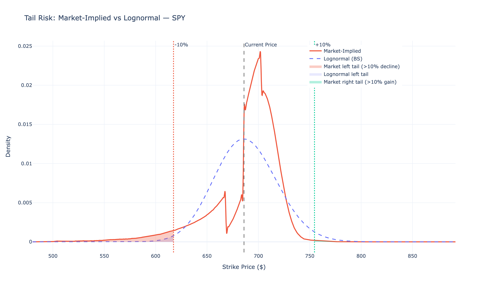
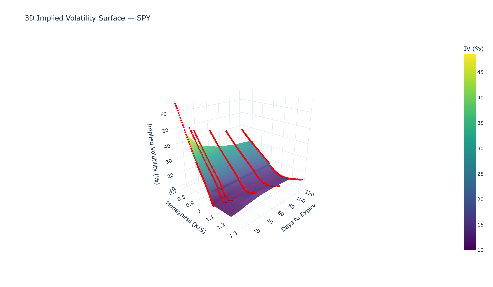
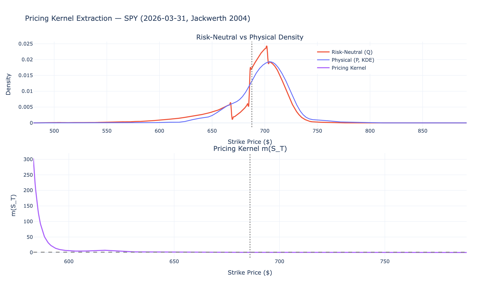

# Breeden-Litzenberger: Extracting Risk-Neutral Distributions from Option Prices

Recovering the probability distribution implied by SPY option market prices using the Breeden-Litzenberger (1978) method, and comparing it against standard Black-Scholes assumptions.



## Overview

Option prices encode the market's collective forward-looking view of where an asset might end up — and how much probability traders assign to extreme moves. The **Breeden-Litzenberger theorem** provides a model-free way to extract this information: the risk-neutral probability density at any price level equals the second derivative of the call price with respect to strike, scaled by the risk-free discount factor:

$$\tilde{\pi}(X) = e^{rT} \frac{\partial^2 c}{\partial X^2}$$

This project implements the full extraction pipeline on live SPY options data.

> **19 publication-quality visualizations** covering the volatility surface, risk-neutral densities, Greeks surfaces, tail risk analysis, pricing kernels, mixture-of-lognormals fitting, and no-arbitrage diagnostics.

## Key Results

The market-implied distribution differs from Black-Scholes in systematic ways:

- **Fat left tail**: the market prices 2-10x more probability of large declines (10-20%) than the lognormal model predicts
- **Negative skew**: the distribution is left-skewed, reflecting persistent demand for downside protection since the 1987 crash
- **Excess kurtosis**: both tails are heavier than lognormal, though the effect is more pronounced on the downside

|  |  |
|:---:|:---:|
| Market-implied RND vs lognormal benchmark | Tail risk comparison |

|  |  |
|:---:|:---:|
| Implied volatility surface | Pricing kernel extraction |

See [results.md](results.md) for the full quantitative analysis with all 19 figures.

## Methodology

Following **Malz (2014)** and **Jackwerth (2004)**, the pipeline implements:

1. **Data acquisition** — Fetch SPY option chains (calls/puts across strikes and expiries) via Yahoo Finance
2. **IV computation** — Invert Black-Scholes using Brent's root-finding to compute implied volatilities
3. **Smile interpolation** — Fit a clamped cubic spline to the OTM volatility smile with flat extrapolation
4. **Call reconstruction** — Rebuild call prices on a fine strike grid using the interpolated smile
5. **BL extraction** — Apply the Breeden-Litzenberger second derivative (butterfly spread approximation) to recover the risk-neutral PDF and CDF
6. **Diagnostics** — Verify no-arbitrage conditions (CDF bounds, PDF non-negativity, mean = forward price, smile slope constraints)
7. **Multi-expiry analysis** — Repeat across maturities to build the full volatility and density surfaces
8. **Extended analysis** — Greeks surfaces, mixture of lognormals fit, state prices, pricing kernel extraction, straddle P&L landscape

## Setup

```bash
git clone https://github.com/jcmcode/risk-neutral-density.git
cd risk-neutral-density
python3 -m venv .venv
source .venv/bin/activate
pip install -r requirements.txt
```

## Running

**Interactive (Jupyter):**

```bash
jupyter notebook notebooks/model.ipynb
```

**Headless (nbconvert):**

```bash
jupyter nbconvert --to notebook --execute --ExecutePreprocessor.timeout=600 \
    --output model_executed.ipynb notebooks/model.ipynb
```

This fetches live market data, runs all analyses, exports figures to `figures/`, and produces an executed notebook with embedded outputs.

## Project Structure

```
risk-neutral-density/
├── notebooks/
│   ├── model.ipynb              # Main notebook (source)
│   └── model_executed.ipynb     # Executed notebook with outputs
├── figures/                     # Exported PNG visualizations (19 figures)
│   └── html/                    # Interactive Plotly HTML figures
├── docs/
│   ├── explanation.md           # Full mathematical walkthrough
│   ├── notes/
│   │   └── bl_summary.png       # Summary figure
│   └── references/              # Academic papers
│       ├── Prices of State-Contingent Claims...pdf   # Breeden & Litzenberger (1978)
│       ├── sr677.pdf                                 # Malz (2014)
│       └── rf-v2004-n1-3925-pdf.pdf                  # Jackwerth (2004)
├── results.md                   # Quantitative findings with embedded figures
├── requirements.txt             # Python dependencies
└── README.md
```

## Documentation

- **[Mathematical Walkthrough](docs/explanation.md)** — Complete derivation from Arrow-Debreu theory through the BL theorem, with implementation details and no-arbitrage conditions
- **[Results](results.md)** — Full analysis with all figures and quantitative findings

## References

1. **Breeden, D.T. and Litzenberger, R.H.** (1978). "Prices of State-Contingent Claims Implicit in Option Prices." *Journal of Business*, 51(4), 621-651.

2. **Malz, A.M.** (2014). "A Simple and Reliable Way to Compute Option-Based Risk-Neutral Distributions." *Federal Reserve Bank of New York Staff Reports*, No. 677.

3. **Jackwerth, J.C.** (2004). "Option-Implied Risk-Neutral Distributions and Risk Aversion." *Research Foundation of CFA Institute*.
