# Results: Risk-Neutral Density Extraction from SPY Options

> **Data disclaimer:** All results are generated from live SPY option market data via Yahoo Finance.
> Values will vary depending on the run date and market conditions at the time of execution.

---

## 1. Volatility Smile and Skew

The implied volatility smile for SPY exhibits the characteristic **downward-sloping skew** seen in equity index options since the 1987 crash. OTM puts trade at significantly higher implied volatility than OTM calls, reflecting the market's demand for downside protection.

A clamped cubic spline interpolation (following Malz 2014) provides a smooth, arbitrage-consistent fit with flat extrapolation at the boundaries.

| 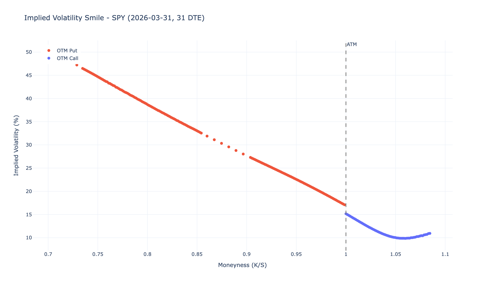 | 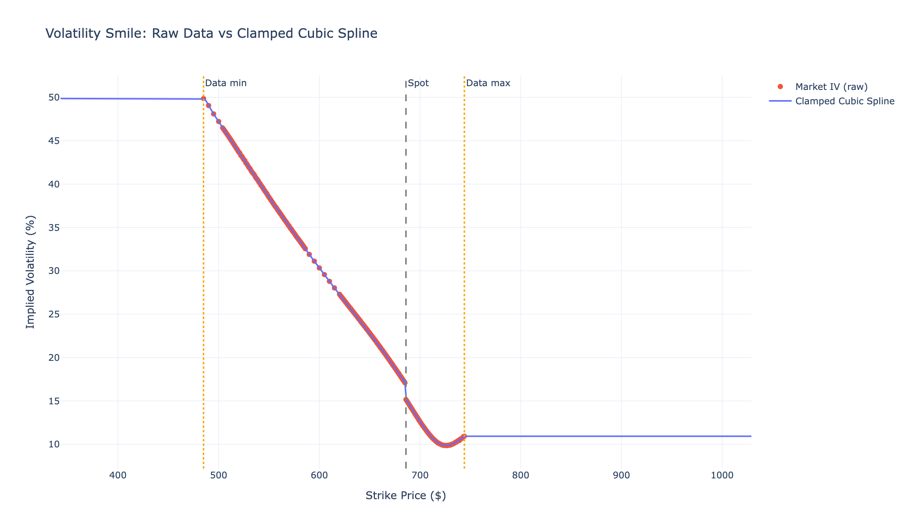 |
|:---:|:---:|
| Raw implied volatilities from OTM puts and calls | Clamped cubic spline interpolation |

---

## 2. Risk-Neutral Distribution vs Lognormal Benchmark

The core Breeden-Litzenberger result: the market-implied risk-neutral density compared against the theoretical lognormal (Black-Scholes) benchmark.

**Key observations:**
- The market-implied distribution is **left-skewed** relative to the lognormal — the market prices more probability of large declines
- The distribution is **leptokurtic** (fatter tails) — both extreme gains and losses are assigned more probability than Black-Scholes assumes
- The risk-neutral mean approximately equals the forward price, confirming no-arbitrage consistency

---

## 3. Fat Tails and Tail Risk

The market assigns substantially more probability to large declines than the lognormal model predicts. Tail risk ratios quantify this divergence.

**Typical tail risk ratios (market-implied / lognormal):**
- 5% decline: ratio near 1.0 (close to lognormal)
- 10% decline: ratio ~1.5-3x (significantly heavier)
- 15-20% decline: ratio ~3-10x+ (order-of-magnitude heavier)

These ratios reflect the **volatility skew premium** — the market's collective pricing of crash risk above what a constant-volatility model would predict.

---

## 4. Sensitivity to Smoothing Parameter

The finite difference step size Delta trades off resolution against smoothness (Malz 2014, Sec. 2.4). The extracted density is stable across a range of step sizes, confirming robustness.

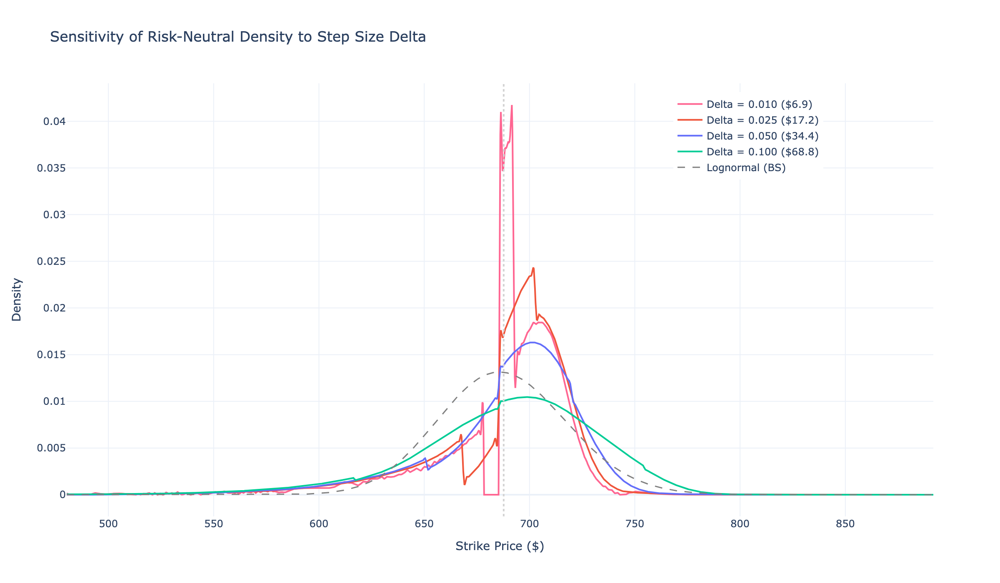

- Alpha = 0.010: highest resolution, some noise
- Alpha = 0.025: baseline (recommended by Malz)
- Alpha = 0.050–0.100: progressively smoother, loses fine structure

---

## 5. Implied Volatility Surface

The 3D implied volatility surface across moneyness and maturity reveals the term structure of the smile.

**Key features:**
- Skew is steepest at short maturities and flattens with time
- ATM volatility shows a term structure (typically upward-sloping in calm markets, inverted during stress)
- The surface encodes the market's complete forward-looking view across strike and maturity

---

## 6. Greeks Surfaces

Option sensitivities (Greeks) plotted across moneyness and maturity reveal how risk exposures shift.

| 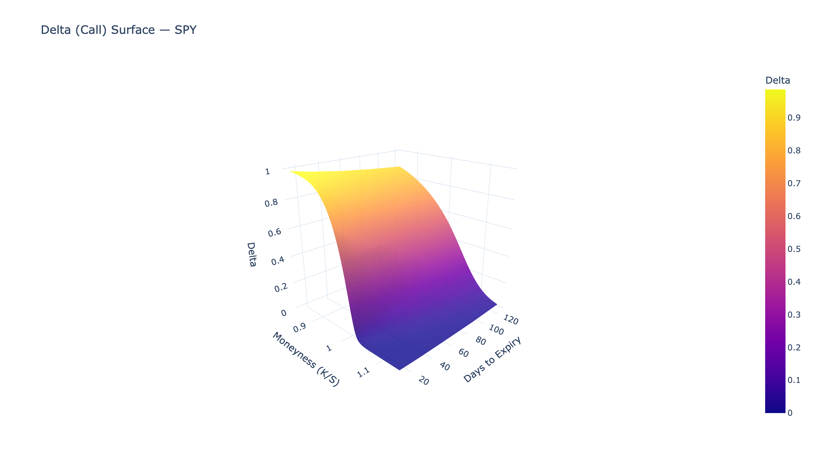 | 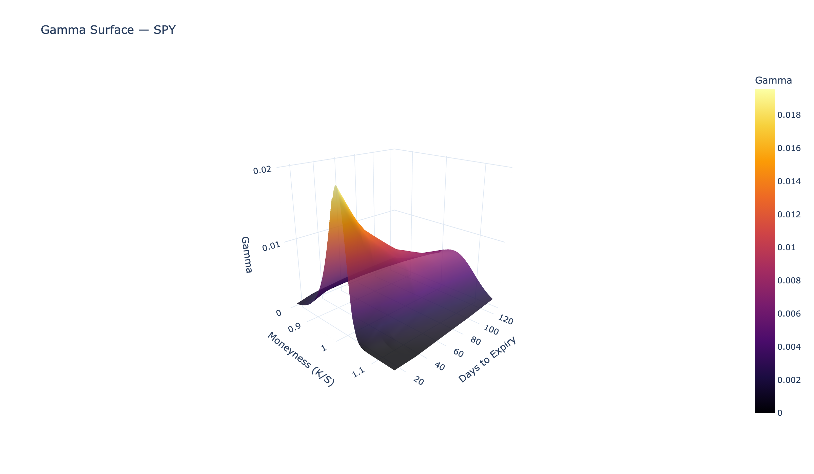 |
|:---:|:---:|
| Delta surface | Gamma surface |

| 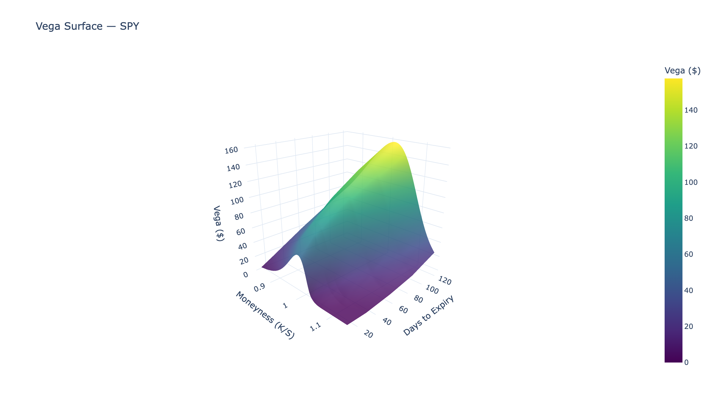 |  |
|:---:|:---:|
| Vega surface | Theta surface |

---

## 7. Skew and Curvature Evolution

| 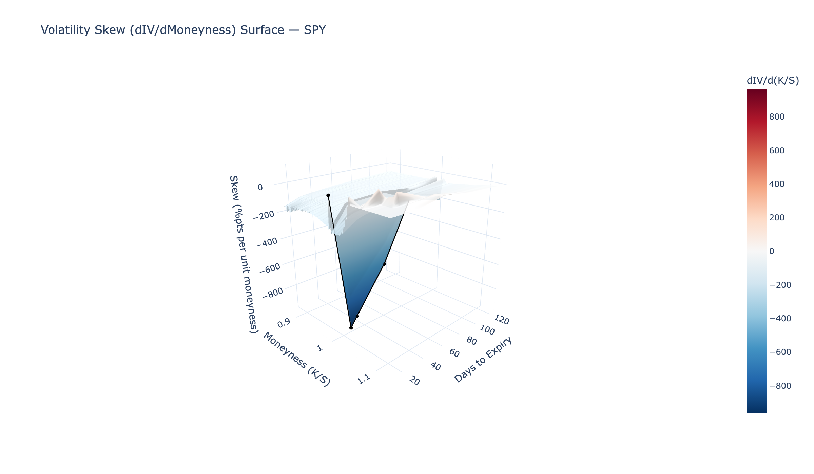 | 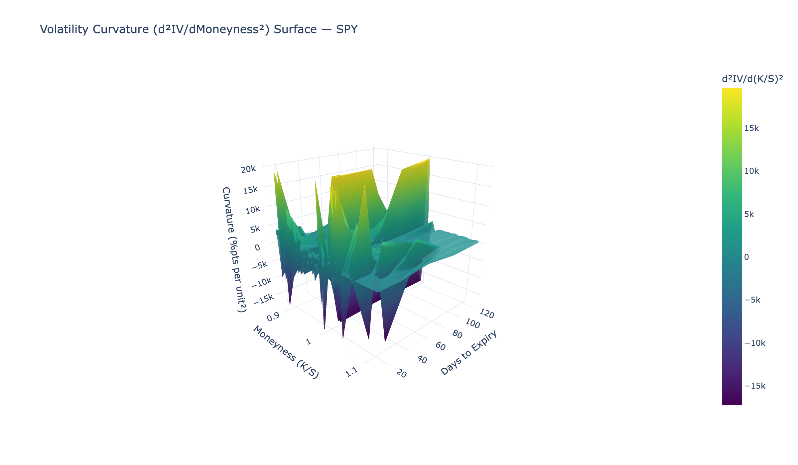 |
|:---:|:---:|
| Volatility skew (dIV/dMoneyness) | Volatility curvature (d²IV/dMoneyness²) |

The skew is consistently negative across maturities (equity index downside protection demand). Curvature captures the "smile" component — highest at short maturities.

---

## 8. Risk-Neutral Density and CDF Surfaces

Applying the Breeden-Litzenberger extraction to each expiry produces the full density and CDF surfaces.

| 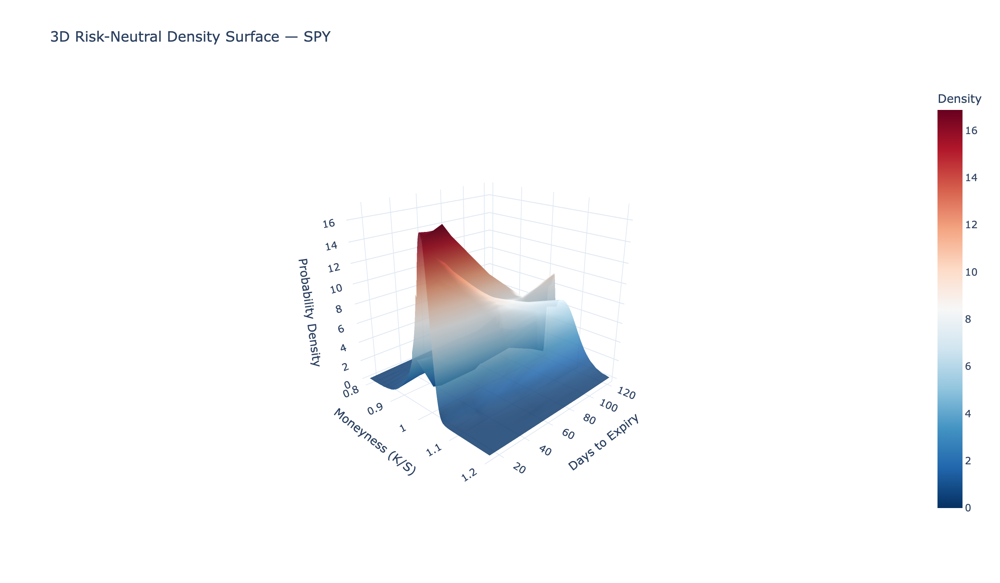 | 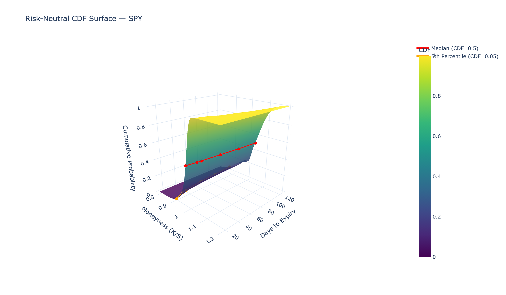 |
|:---:|:---:|
| Risk-neutral density surface | Cumulative distribution surface |

- Short-dated distributions are narrow and peaked
- Longer-dated distributions spread out (diffusion scaling)
- Left-skew persists across all maturities

---

## 9. Term Structure of Risk-Neutral Moments

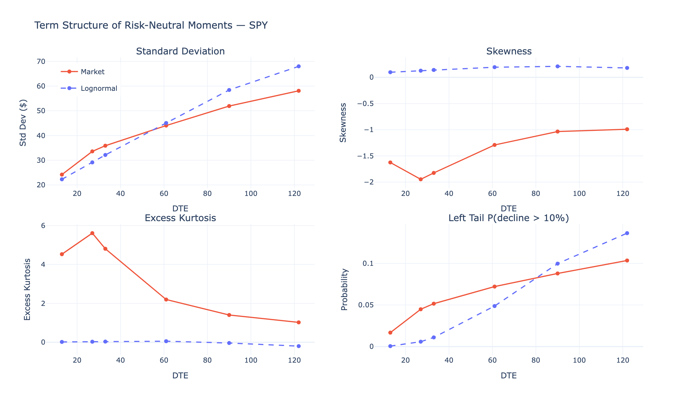

Comparing market-implied moments against the lognormal benchmark across maturities:
- **Standard deviation** grows with sqrt(T) for both, with the market-implied slightly wider
- **Skewness** is negative at all maturities (market vs ~0 for lognormal)
- **Excess kurtosis** is positive and decreases with maturity (central limit theorem)
- **Left-tail probability** increases with maturity for both, but faster for market-implied

---

## 10. Mixture of Lognormals Fit

A two-component lognormal mixture (Jackwerth 2004, Exhibit 1) provides a simple parametric approximation to the market-implied density.

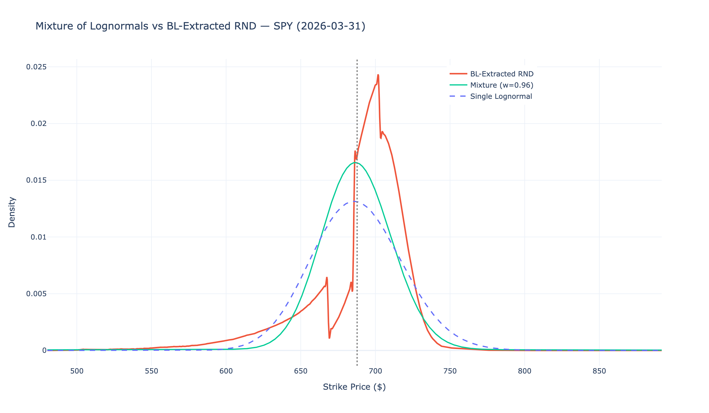

The mixture captures the skew by combining a lower-volatility "normal regime" component with a higher-volatility "stress regime" component.

---

## 11. State Prices and Arrow-Debreu Securities

The state price density p(X) = e^(-rT) * pi(X) gives the price of Arrow-Debreu securities (BL 1978, Theorem 1; Jackwerth 2004, Eq. 7).

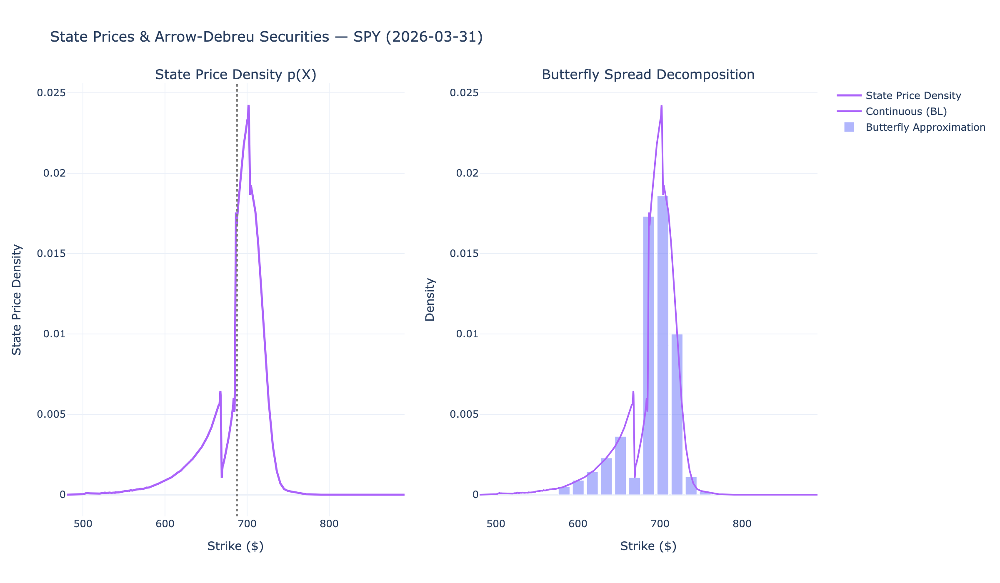

The integral of state prices equals the discount factor e^(-rT), confirming internal consistency.

---

## 12. No-Arbitrage Diagnostics

The volatility smile must satisfy slope constraints to prevent arbitrage (Malz 2014, Eq. 7-8).

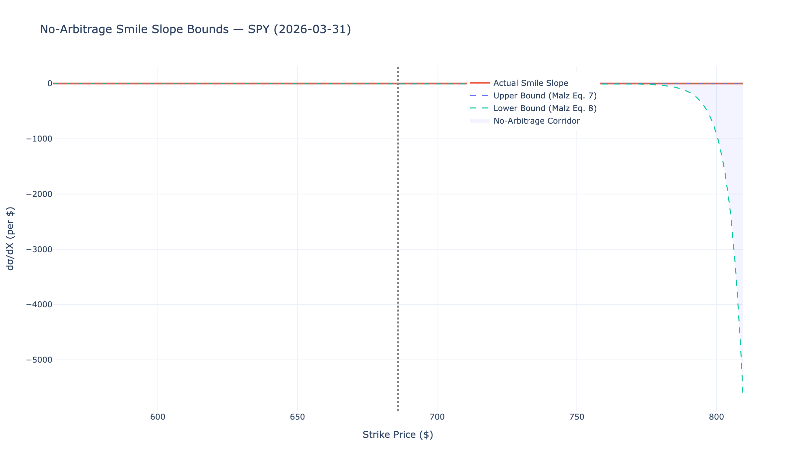

**Diagnostic checks (all pass):**
- CDF ranges from ~0 to ~1 at strike grid boundaries
- PDF is non-negative everywhere (after numerical flooring)
- Risk-neutral mean matches the forward price
- Smile slope remains within no-arbitrage bounds

---

## 13. Pricing Kernel

The pricing kernel m(S_T) = pi(S_T) / [e^(rT) * f^P(S_T)] connects risk-neutral to physical probabilities (Jackwerth 2004, Eq. 12).

|  | 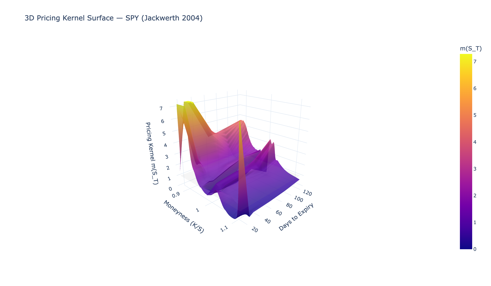 |
|:---:|:---:|
| Single-expiry pricing kernel | 3D pricing kernel surface |

The pricing kernel is generally decreasing (consistent with risk aversion) but may exhibit local non-monotonicity — the **pricing kernel puzzle** documented by Jackwerth (2000).

---

## 14. Straddle P&L Landscape

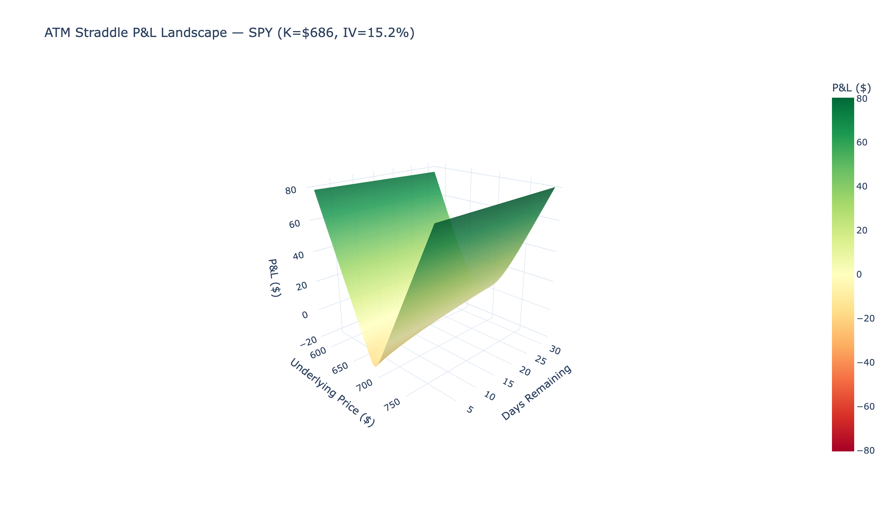

The ATM straddle P&L surface shows how profit depends on both the underlying price movement and time remaining. The V-shaped payoff at expiry transitions to a smooth surface with positive time value.

---

## Visualization Gallery

| # | Figure | Description |
|---|--------|-------------|
| 1 | [Volatility Smile (Raw)](figures/01_volatility_smile_raw.png) | OTM put/call implied volatilities vs moneyness |
| 2 | [Volatility Smile (Spline)](figures/02_volatility_smile_spline_fit.png) | Clamped cubic spline fit with flat extrapolation |
| 3 | [Call Valuation Function](figures/03_call_valuation_function.png) | BS call prices reconstructed from interpolated smile |
| 4 | [Risk-Neutral Distribution](figures/04_risk_neutral_distribution.png) | Market-implied RND vs lognormal benchmark (4-panel) |
| 5 | [Sensitivity Analysis](figures/05_sensitivity_delta.png) | RND sensitivity to finite difference step size |
| 6 | [Tail Risk](figures/06_tail_risk.png) | Shaded tail comparison: market vs lognormal |
| 7 | [IV Surface 3D](figures/07_iv_surface_3d.png) | Implied volatility surface across moneyness and maturity |
| 8a | [Delta Surface](figures/08a_greeks_delta.png) | Call delta across moneyness and maturity |
| 8b | [Gamma Surface](figures/08b_greeks_gamma.png) | Gamma across moneyness and maturity |
| 8c | [Vega Surface](figures/08c_greeks_vega.png) | Vega across moneyness and maturity |
| 8d | [Theta Surface](figures/08d_greeks_theta.png) | Theta across moneyness and maturity |
| 9a | [Skew Evolution](figures/09a_skew_evolution.png) | Volatility skew surface |
| 9b | [Curvature Evolution](figures/09b_curvature_evolution.png) | Volatility curvature surface |
| 10 | [RND Surface 3D](figures/10_rnd_surface_3d.png) | Risk-neutral density surface across maturity |
| 11 | [CDF Surface 3D](figures/11_cdf_surface_3d.png) | Risk-neutral CDF surface across maturity |
| 12 | [Term Structure of Moments](figures/12_term_structure_moments.png) | Skewness, kurtosis, std dev, tail prob vs maturity |
| 13 | [Mixture of Lognormals](figures/13_mixture_lognormals.png) | Two-component lognormal mixture fit |
| 14 | [State Prices](figures/14_state_prices.png) | Arrow-Debreu state price density |
| 15 | [No-Arbitrage Bounds](figures/15_no_arbitrage_bounds.png) | Smile slope vs arbitrage constraints |
| 16 | [Pricing Kernel](figures/16_pricing_kernel.png) | Single-expiry pricing kernel extraction |
| 17 | [Pricing Kernel Surface](figures/17_pricing_kernel_surface_3d.png) | 3D pricing kernel across maturity |
| 18 | [Straddle P&L](figures/18_straddle_pnl_landscape.png) | ATM straddle P&L landscape |
| 19 | [Summary (Publication)](figures/summary_publication.png) | 6-panel matplotlib summary figure |
